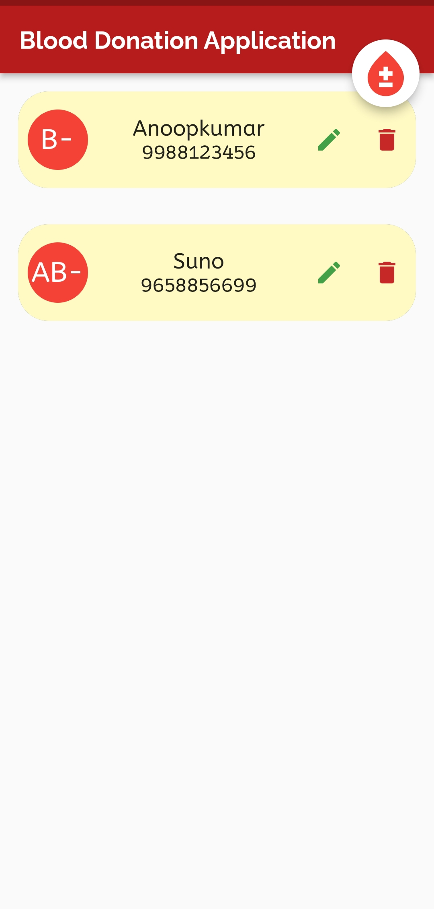

# blood_donation_firebase

A new Flutter project with Firebase CRUD (Create Read Update Delete) Operation

## UI Screenshot

## Packages

cloud_firestore: ^4.4.3 [Click Here](https://pub.dev/packages/cloud_firestore)

firebase_core: ^2.7.0 [Click Here](https://pub.dev/packages/firebase_core)

easy_splash_screen: ^1.0.4 [Click Here] https://pub.dev/packages/easy_splash_screen

google_fonts : [Click Here](https://pub.dev/packages/google_fonts)
